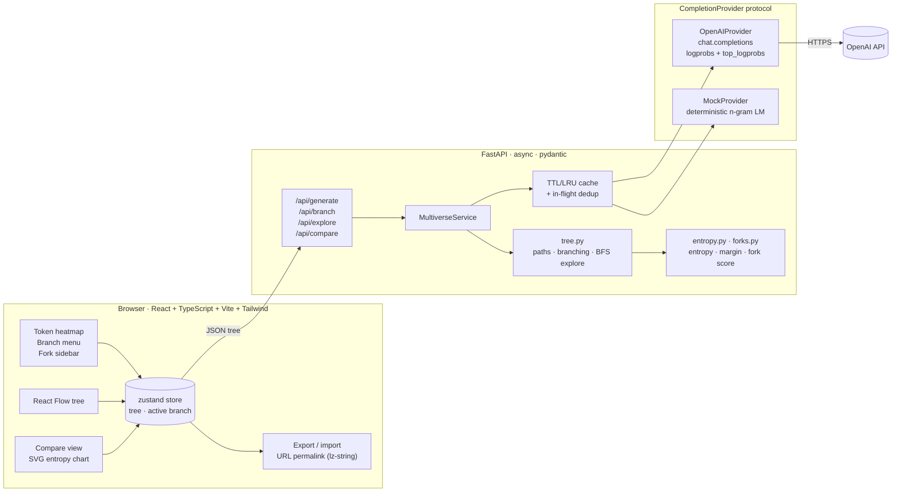

<div align="center">


# Multiverse

**See what the language model *almost* said.**

Multiverse shows an LLM completion one token at a time, with the probability of each token
and the alternatives the model considered. Click any token to force a different choice,
and the story branches into a tree of alternate futures you can zoom around.


<sub>All screenshots are real captures of the app in <b>demo mode</b> (deterministic mock model, no API key), taken with Playwright by <a href="scripts/screenshots.py"><code>scripts/screenshots.py</code></a>.</sub>

</div>

---

## Why this is interesting

A chat reply looks like one confident answer. Underneath, the model sampled every token
from a probability distribution, and at some positions it was close to a coin flip.
Those positions are **fork points**. A different choice there can send the whole answer
somewhere else: a different plot twist, a different "fact", a different conclusion.

Multiverse makes fork points visible:

- **Uncertainty becomes something you can see.** Colour every token by probability or
  entropy, and hover to see up to 20 alternatives the model weighed.
- **It's a practical lens on hallucination.** When a factual claim sits on a
  high-entropy token (a name, a date, a number), the model was guessing. Fork points
  show you where to be skeptical, and branching shows you what the other guesses were.
- **You can test counterfactuals.** Force a different token and watch how the rest of
  the answer shifts. Is the conclusion robust, or does one token flip it?
- **Temperature and model choice become measurable.** Compare mode puts two runs side by
  side with a per-token entropy chart and the index of the first divergence.

## Features

| | |
|---|---|
| **Token heatmap** | Completion rendered token by token and coloured by probability or entropy. Hover a token for its top alternatives, probability, entropy and top-2 margin. |
| **Branching** | Click a token and pick an alternative, or type your own. The backend continues from `prefix + forced token`, and the branch is added to the tree. |
| **Multiverse tree** | Animated, zoomable React Flow tree. Click a node to switch branches. The active path is highlighted. |
| **Fork points** | High-entropy / small-margin tokens are detected, underlined, and listed in a sidebar ranked by uncertainty. Thresholds can be tuned live. |
| **Auto-explore** | Expands the top-k fork points N levels deep in parallel, within a server-side node budget. |
| **Compare mode** | Same prompt with two temperatures or two models, side by side: per-token entropy chart, first divergence index, shared prefix, position agreement, mean \|ΔH\|. |
| **Export / import / share** | Download a tree as JSON and load it back, or copy a permalink that stores the whole tree (compressed) in the URL hash. No server storage. |
| **Demo mode** | A deterministic mock provider produces plausible logprobs, so everything works with no API key. The UI shows a clear **DEMO** banner and badge. |
| **Caching** | Identical provider requests are served from an async TTL/LRU cache, and concurrent duplicates are merged into one upstream call. |

<table>
<tr>
<td width="50%"><br/><sub><b>Hover:</b> the alternatives at a fork point</sub></td>
<td width="50%"><br/><sub><b>Click:</b> branch on an alternative or your own token</sub></td>
</tr>
<tr>
<td width="50%"><br/><sub><b>Explore:</b> the multiverse tree after auto-explore</sub></td>
<td width="50%"><br/><sub><b>Compare:</b> T=0 vs T=1.2 with divergence metrics</sub></td>
</tr>
</table>

## Quickstart

### Docker (one command)

```bash
git clone https://github.com/gfxroy/multiverse && cd multiverse
cp .env.example .env          # optional: add OPENAI_API_KEY, or leave it empty for demo mode
docker compose up --build     # → http://localhost:8080
```

### Local development

Requirements: Python 3.11+, Node 20.19+ (22 recommended).

```bash
make install    # backend venv + frontend deps
make dev        # API on :8000 with reload + Vite on :5173 (proxies /api)
```

<details>
<summary>Without make</summary>

```bash
cd backend && python3 -m venv .venv && .venv/bin/pip install -e ".[dev]"
.venv/bin/uvicorn app.main:app --reload --port 8000
# in another terminal
cd frontend && npm ci && npm run dev
```
</details>

Open <http://localhost:5173>, press **Generate**, then click an underlined token.

### Using real OpenAI models

Put your key in `.env` (never commit it; `.env` is git-ignored) and restart:

```bash
OPENAI_API_KEY=sk-...
```

With `MULTIVERSE_PROVIDER=auto` (the default), the backend uses OpenAI when a key is set
and falls back to demo mode when it isn't. The header badge always shows which one is
active.

## Architecture



- **The frontend holds the tree.** Every branch or explore request sends the current tree,
  and the backend returns the updated one. This keeps the server stateless, so there's no
  database, and makes export and permalinks trivial.
- **All tree logic lives in the backend**, in pure, well-tested functions
  (`backend/app/tree.py`). The frontend only reconstructs paths for display and lays out
  the tree.
- **Providers sit behind a tiny protocol**
  (`complete(prompt, settings, prefix) -> ProviderResult`), so the OpenAI, mock and cache
  layers compose, and new backends are easy to add.

### API

| Method | Path | Body → Response |
|---|---|---|
| `GET` | `/api/config` | → provider, demo flag, models, limits |
| `GET` | `/api/health` | → status + cache stats |
| `POST` | `/api/generate` | `{prompt, settings, fork_settings}` → `Tree` |
| `POST` | `/api/branch` | `{tree, node_id, position, token}` → `{tree, node_id, created}` |
| `POST` | `/api/explore` | `{tree, node_id, top_k, depth}` → `{tree, created, truncated}` |
| `POST` | `/api/compare` | `{prompt, a, b, max_tokens, top_logprobs}` → `{a, b, metrics}` |

Interactive docs are at `http://localhost:8000/docs` (FastAPI/OpenAPI).

## How branching works

The Chat Completions API can't prefill the assistant's reply, so branches use a
**continuation prompt**. The text so far plus the forced token is sent as a previous
assistant message, followed by a short instruction to continue it verbatim:

```text
user:      <original prompt>
assistant: <prefix + forced token>
user:      Continue your previous message exactly where it stopped… output only the continuation.
```

This works well in practice, but it's an **approximation**, and Multiverse labels it that
way (`method: chat-continuation`):

- In a branch, the model is continuing a message rather than generating the original
  reply, so branch probabilities are close to, but not exactly, the true
  `p(token | prompt, prefix)`. **Root-node numbers are exact API values.**
- Models sometimes drop or add a leading space, or repeat part of the draft.
- Only the top ≤ 20 alternatives are visible. Entropy counts the unobserved mass as one
  "tail" bucket, which gives a **lower bound** on the true entropy.
- Reasoning models generally don't return logprobs. Use a chat model such as
  `gpt-4o-mini`.

The full write-up, including the data model, auto-explore, and why the legacy Completions
API or open-weights models aren't used, is in **[docs/branching.md](docs/branching.md)**.

## Demo mode

With no API key, the backend uses `MockProvider`. It's a small word-level trigram/bigram
model over a hand-written corpus, with prompt-keyword boosting and hash-derived "model
personality" noise. It is:

- **deterministic**: the same request always returns the same tokens, which is handy for
  tests and screenshots;
- **causal**: forcing a different token changes what comes next, so branching and
  auto-explore behave realistically;
- **clearly labelled**: a DEMO banner and header badge are always visible.

It's there to show the interface, not to produce good prose. The text is plausible-looking
but often nonsensical.

## Configuration

All settings are environment variables (see [`.env.example`](.env.example)):

| Variable | Default | Description |
|---|---|---|
| `OPENAI_API_KEY` | *(empty)* | Your key. Empty means demo mode. |
| `OPENAI_BASE_URL` | *(unset)* | Optional OpenAI-compatible endpoint that supports logprobs |
| `MULTIVERSE_PROVIDER` | `auto` | `auto`, `openai` or `mock` |
| `MULTIVERSE_DEFAULT_MODEL` | `gpt-4o-mini` | Model selected by default |
| `MULTIVERSE_MODELS` | `["gpt-4o-mini", …]` | JSON list shown in the picker (any name can be typed) |
| `MULTIVERSE_MAX_TOKENS_LIMIT` | `512` | Server-side cap on `max_tokens` |
| `MULTIVERSE_MAX_EXPLORE_NODES` | `24` | Max nodes created per auto-explore run |
| `MULTIVERSE_CACHE_SIZE` / `_TTL` | `512` / `3600` | Provider cache entries / seconds |
| `MULTIVERSE_CORS_ORIGINS` | Vite dev origins | JSON list of allowed origins |

## Tests and quality

```bash
make test    # pytest (backend) + vitest (frontend)
make lint    # ruff, ruff format, mypy --strict · oxlint, prettier, tsc
```

- **Backend (pytest):** entropy math (including truncated-distribution edge cases), fork
  detection and ranking, the mock provider (determinism, well-formed logprobs, greedy
  decoding), the OpenAI provider against a fake SDK client (request parameters,
  continuation messages, missing-logprob errors), branching logic (prefixes, ancestor
  ownership, idempotency, cycles), auto-explore budgets, cache TTL/LRU/dedup, compare
  metrics and every API route.
- **Frontend (vitest + Testing Library):** path reconstruction, tree layout, fork scoring
  (mirrors the backend), permalink round-trips, colour scales and the branch menu
  component.

## Project layout

```
backend/
  app/
    main.py            FastAPI app factory, error handling, CORS
    api.py             routes
    service.py         orchestration: providers ↔ tree ↔ metrics
    tree.py            branching tree: paths, owners, branch, BFS explore
    entropy.py         truncated entropy, margins, alternatives
    forks.py           fork-point scoring and detection
    compare.py         divergence metrics
    providers/         protocol, OpenAI, mock (+ corpus), TTL cache
  tests/               pytest suite
frontend/
  src/
    components/        TokenView, TokenStrip, TokenInspector, TreeView, ForkSidebar, CompareView…
    lib/               API client, tree utils, fork math, share links, colour scales
    store.ts           zustand state
docs/                  screenshots, GIF, branching write-up
scripts/               dev runner, Playwright screenshot capture
```

## Roadmap

- [ ] Exact-continuation providers for open-weights models (vLLM / llama.cpp), with full
      distributions instead of top-20
- [ ] Streaming tokens into the heatmap as they arrive
- [ ] Semantic clustering of sibling branches ("these 5 branches say the same thing")
- [ ] Calibration view: fork points vs. factual claims, for hallucination studies
- [ ] Server-side saved trees with short share links (for trees too big for a URL)
- [ ] Byte-level token rendering for multi-byte characters

## License

[MIT](LICENSE) © 2026 Aaditya Roy
