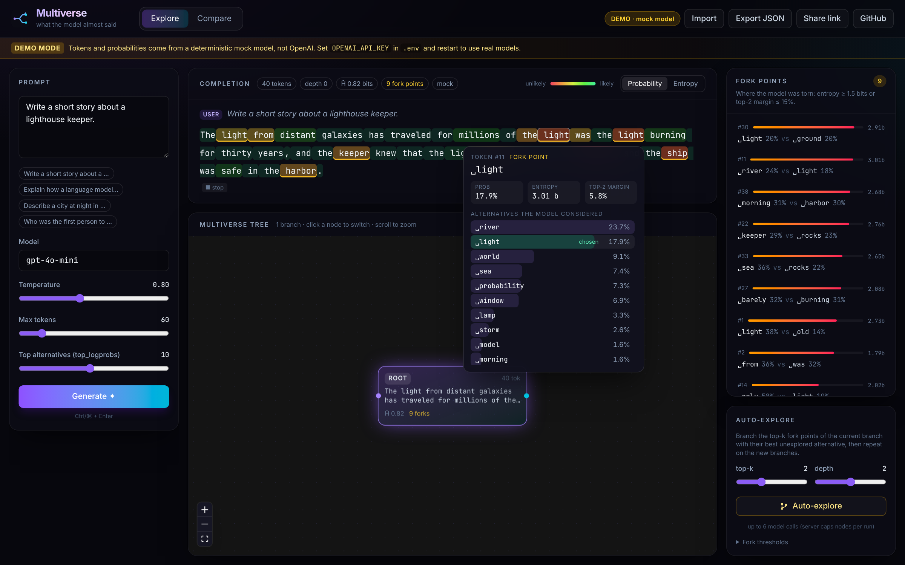
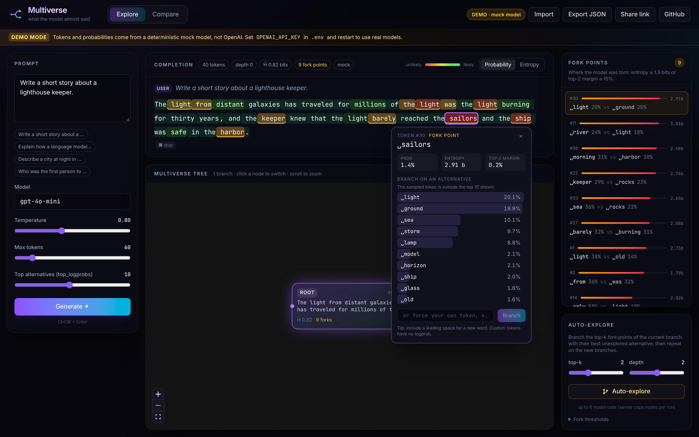
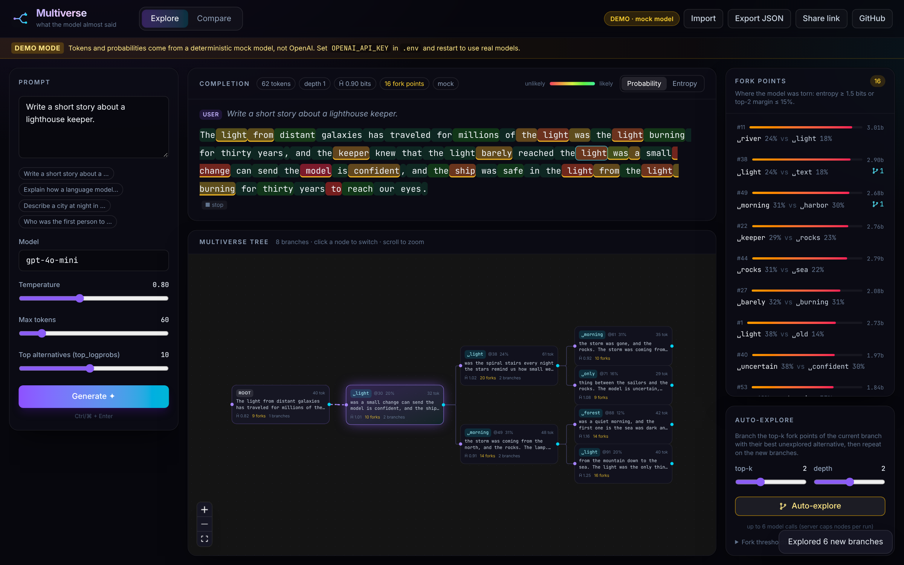
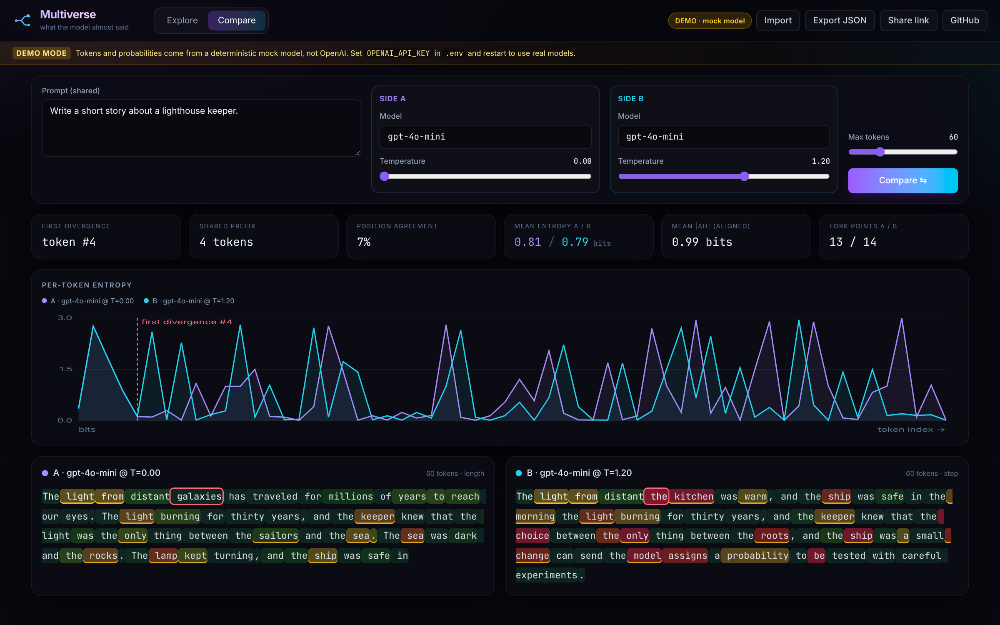
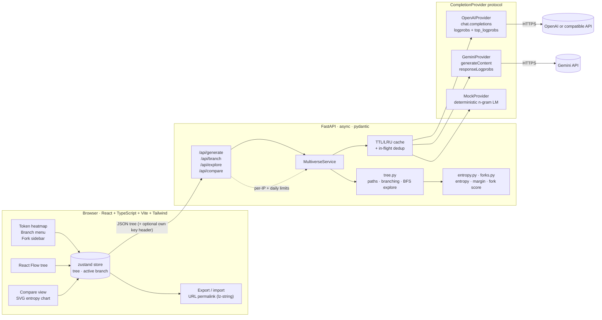

<div align="center">


# Multiverse

**See what the language model *almost* said.**

Multiverse shows an LLM completion one token at a time, with the probability of each token
and the alternatives the model considered. Click any token to force a different choice,
and the story branches into a tree of alternate futures you can zoom around.

### [▶ Live demo: gfxroy.github.io/multiverse](https://gfxroy.github.io/multiverse/)

<sub>Runs entirely in your browser: a deterministic mock model by default, or real OpenAI models with your own key (sent only to api.openai.com).</sub>

[](https://github.com/gfxroy/multiverse/actions/workflows/ci.yml)
[](https://gfxroy.github.io/multiverse/)


<sub>All screenshots are real captures of the app in <b>demo mode</b> (deterministic mock model, no API key), taken with Playwright by <a href="scripts/screenshots.py"><code>scripts/screenshots.py</code></a>.</sub>

</div>

---

## Why this is interesting

A chat reply looks like one confident answer. Underneath, the model sampled every token
from a probability distribution, and at some positions it was close to a coin flip.
Those positions are **fork points**. A different choice there can send the whole answer
somewhere else: a different plot twist, a different "fact", a different conclusion.

Multiverse makes fork points visible:

- **Uncertainty becomes something you can see.** Colour every token by probability or
  entropy, and hover to see up to 20 alternatives the model weighed.
- **It's a practical lens on hallucination.** When a factual claim sits on a
  high-entropy token (a name, a date, a number), the model was guessing. Fork points
  show you where to be skeptical, and branching shows you what the other guesses were.
- **You can test counterfactuals.** Force a different token and watch how the rest of
  the answer shifts. Is the conclusion robust, or does one token flip it?
- **Temperature and model choice become measurable.** Compare mode puts two runs side by
  side with a per-token entropy chart and the index of the first divergence.

## Features

| | |
|---|---|
| **Token heatmap** | Completion rendered token by token and coloured by probability or entropy. Hover a token for its top alternatives, probability, entropy and top-2 margin. |
| **Branching** | Click a token and pick an alternative, or type your own. The backend continues from `prefix + forced token`, and the branch is added to the tree. |
| **Multiverse tree** | Animated, zoomable React Flow tree. Click a node to switch branches. The active path is highlighted. |
| **Fork points** | High-entropy / small-margin tokens are detected, underlined, and listed in a sidebar ranked by uncertainty. Thresholds can be tuned live. |
| **Auto-explore** | Expands the top-k fork points N levels deep in parallel, within a server-side node budget. |
| **Compare mode** | Same prompt with two temperatures or two models, side by side: per-token entropy chart, first divergence index, shared prefix, position agreement, mean \|ΔH\|. |
| **Export / import / share** | Download a tree as JSON and load it back, or copy a permalink that stores the whole tree (compressed) in the URL hash. No server storage. |
| **Providers** | OpenAI (and any OpenAI-compatible endpoint that returns logprobs), native Gemini API, or the built-in mock. Visitors can also use their own key, which stays in their browser tab. |
| **Demo mode** | A deterministic mock provider produces plausible logprobs, so everything works with no API key. The UI shows a clear **DEMO** banner and badge. |
| **Public-demo ready** | Per-visitor and daily rate limits (auto-explore is charged per branch it spawns), server-side caps, friendly 429 messages, and a single-container image for Hugging Face Spaces. |
| **Caching** | Identical provider requests are served from an async TTL/LRU cache, and concurrent duplicates are merged into one upstream call. |

<table>
<tr>
<td width="50%"><br/><sub><b>Hover:</b> the alternatives at a fork point</sub></td>
<td width="50%"><br/><sub><b>Click:</b> branch on an alternative or your own token</sub></td>
</tr>
<tr>
<td width="50%"><br/><sub><b>Explore:</b> the multiverse tree after auto-explore</sub></td>
<td width="50%"><br/><sub><b>Compare:</b> T=0 vs T=1.2 with divergence metrics</sub></td>
</tr>
</table>

## Quickstart

### Docker (one command)

```bash
git clone https://github.com/gfxroy/multiverse && cd multiverse
cp .env.example .env          # optional: add OPENAI_API_KEY, or leave it empty for demo mode
docker compose up --build     # → http://localhost:8080
```

### Local development

Requirements: Python 3.11+, Node 20.19+ (22 recommended).

```bash
make install    # backend venv + frontend deps
make dev        # API on :8000 with reload + Vite on :5173 (proxies /api)
```

<details>
<summary>Without make</summary>

```bash
cd backend && python3 -m venv .venv && .venv/bin/pip install -e ".[dev]"
.venv/bin/uvicorn app.main:app --reload --port 8000
# in another terminal
cd frontend && npm ci && npm run dev
```
</details>

Open <http://localhost:5173>, press **Generate**, then click an underlined token.

### Using real OpenAI models

Put your key in `.env` (never commit it; `.env` is git-ignored) and restart:

```bash
OPENAI_API_KEY=sk-...
```

With `MULTIVERSE_PROVIDER=auto` (the default), the backend uses OpenAI if `OPENAI_API_KEY`
is set, otherwise Gemini if `GEMINI_API_KEY` is set, and demo mode if neither is set. The
header badge always shows which one is active.

### Using other providers (e.g. Gemini)

Multiverse needs per-token `logprobs` **and** top-k alternatives, and not every API returns
them:

| Provider / endpoint | Logprobs + alternatives? | How to use it |
|---|---|---|
| OpenAI Chat Completions (`gpt-4o-mini`, `gpt-4.1-*`, `gpt-4o`) | ✅ up to 20 alternatives | `OPENAI_API_KEY=...` |
| OpenAI reasoning models (o-series etc.) | ❌ rejected by the API | use a non-reasoning chat model |
| **Gemini, native API**, 2.x models (`gemini-2.5-flash`, `gemini-2.5-flash-lite`) | ⚠️ documented as `responseLogprobs` + `logprobs` (1–20), but only for keys that still have 2.x access | `GEMINI_API_KEY=...` (built-in `GeminiProvider`) |
| Gemini 3.x, `gemini-*-latest` aliases, Gemma 4 | ❌ `400 Logprobs is not enabled for this model` | none right now |
| Gemini's OpenAI-compatible endpoint (`…/v1beta/openai/`) | ❌ `logprobs` isn't supported there | use the native provider above |
| Self-hosted OpenAI-compatible servers (e.g. vLLM) | ✅ usually (check your server) | `OPENAI_API_KEY=anything`, `OPENAI_BASE_URL=http://host:port/v1` |

`OPENAI_BASE_URL` points the OpenAI provider at any OpenAI-compatible endpoint. If the
endpoint rejects `logprobs`, you'll get a clear error in the UI instead of a silent failure.
`MULTIVERSE_DEFAULT_MODEL` and `MULTIVERSE_MODELS` set the model picker; the defaults
follow the active provider.

For Gemini, the native provider calls `models/{model}:generateContent` with
`responseLogprobs: true`, turns off "thinking" on 2.5 Flash models so the output budget goes
to visible tokens, and retries 429/5xx responses with backoff. It is tested against Google's
documented response schema, including a fake Gemini HTTP server
([`backend/tests/fake_gemini.py`](backend/tests/fake_gemini.py)) used for end-to-end runs.
**Live check (September 2026):** with a newly created AI Studio key, the 2.x models return
`404 … no longer available to new users`, and every 3.x, `-latest` and Gemma model the key
can use returns `400 Logprobs is not enabled for this model` (the OpenAI-compatible endpoint
rejects the `logprobs` field outright). So Gemini works here only if your key still has
access to a 2.x model. Otherwise use OpenAI or a self-hosted OpenAI-compatible server. If a
model refuses logprobs, the UI shows Google's error with an explanation.

Visitors can click **Use your key** in the header to use their own OpenAI or Gemini key. The
key stays in that browser tab (`sessionStorage`) and is sent as a header with each request.
The server uses it only for that request, never stores or logs it, and always sends visitor
keys to the provider's official endpoint (a custom base URL applies only to the server's
own key).

### Static build (GitHub Pages)

The [live demo](https://gfxroy.github.io/multiverse/) is a static build with no backend. The
mock model, entropy and fork-point detection, branching, auto-explore and compare metrics
are ported to TypeScript ([`frontend/src/engine/`](frontend/src/engine/)). A small local
API ([`engine/local.ts`](frontend/src/engine/local.ts)) has the same shape as the HTTP
client, so the UI is unchanged. The TypeScript tests mirror the backend's tests for these
modules.

- **Demo mode:** the same corpus and n-gram approach as the Python mock. The hash and RNG
  differ, so the exact text differs from the server's demo mode, but the behaviour matches
  (deterministic, topic-aware, branchable).
- **Your own OpenAI key:** the browser calls `https://api.openai.com/v1/chat/completions`
  directly with `logprobs`/`top_logprobs`, using the same continuation prompt as the
  backend. The key stays in `sessionStorage` for that tab and goes nowhere else. The
  browser caps `max_tokens` at 200 and auto-explore at 10 branches per run. Gemini isn't
  offered there.
- **Share links** keep the tree in the URL hash (`#t=…`), which works on static hosting.

```bash
cd frontend && npm run build:pages   # VITE_STATIC=1, base /multiverse/ → dist-pages/
```

[`.github/workflows/pages.yml`](.github/workflows/pages.yml) runs the tests, builds, and
deploys to GitHub Pages on every push to `main`.
[`scripts/verify_pages.py`](scripts/verify_pages.py) is a headless Playwright check of a
deployed build: load, demo banner, generate, hover, branch, auto-explore, share link,
compare and the key menu.

### Hosting the server version (single container)

The FastAPI server version is still the full-featured one: server-side keys, OpenAI-compatible
endpoints, the native Gemini provider, rate limits and caching.
[`Dockerfile.space`](Dockerfile.space) builds the frontend and serves it from FastAPI in a
single container on port 7860, with conservative public-demo defaults baked in:

- **Per-visitor rate limit:** 10 model calls per 10 minutes per IP. Auto-explore is charged
  for every branch it spawns, and a run that hits the limit stops early and says so.
- **Global daily cap:** 500 calls per UTC day with the server's key. Own-key requests skip it.
- **Server-side caps:** `max_tokens` ≤ 120, `top_logprobs` ≤ 10, ≤ 6 branches per
  auto-explore run, prompt length and tree size limits.
- **Friendly 429s:** the message shows up in the UI with a retry hint, and the header shows
  how many calls you have left.

```bash
docker build -f Dockerfile.space -t multiverse-space .
docker run -p 7860:7860 -e GEMINI_API_KEY=... multiverse-space   # → http://localhost:7860
```

The image runs on any Docker host. For Hugging Face Spaces, the front-matter and deploy
notes are in [`deploy/huggingface/`](deploy/huggingface/). Docker Spaces need a paid plan
there (free cpu-basic is limited to static Spaces as of September 2026). Keys belong in the
host's secret store, never in the repo. Rate-limit state is in memory, which fits a single
container.

## Architecture



- **The frontend holds the tree.** Every branch or explore request sends the current tree,
  and the backend returns the updated one. This keeps the server stateless, so there's no
  database, and makes export and permalinks trivial.
- **All tree logic lives in the backend**, in pure, well-tested functions
  (`backend/app/tree.py`). The frontend only reconstructs paths for display and lays out
  the tree.
- **Providers sit behind a tiny protocol**
  (`complete(prompt, settings, prefix) -> ProviderResult`), so the OpenAI, mock and cache
  layers compose, and new backends are easy to add.

### API

| Method | Path | Body → Response |
|---|---|---|
| `GET` | `/api/config` | → provider, demo flag, models, limits |
| `GET` | `/api/health` | → status + cache stats |
| `POST` | `/api/generate` | `{prompt, settings, fork_settings}` → `Tree` |
| `POST` | `/api/branch` | `{tree, node_id, position, token}` → `{tree, node_id, created}` |
| `POST` | `/api/explore` | `{tree, node_id, top_k, depth}` → `{tree, created, truncated}` |
| `POST` | `/api/compare` | `{prompt, a, b, max_tokens, top_logprobs}` → `{a, b, metrics}` |

Interactive docs are at `http://localhost:8000/docs` (FastAPI/OpenAPI).

## How branching works

The Chat Completions API can't prefill the assistant's reply, so branches use a
**continuation prompt**. The text so far plus the forced token is sent as a previous
assistant message, followed by a short instruction to continue it verbatim:

```text
user:      <original prompt>
assistant: <prefix + forced token>
user:      Continue your previous message exactly where it stopped… output only the continuation.
```

This works well in practice, but it's an **approximation**, and Multiverse labels it that
way (`method: chat-continuation`):

- In a branch, the model is continuing a message rather than generating the original
  reply, so branch probabilities are close to, but not exactly, the true
  `p(token | prompt, prefix)`. **Root-node numbers are exact API values.**
- Models sometimes drop or add a leading space, or repeat part of the draft.
- Only the top ≤ 20 alternatives are visible. Entropy counts the unobserved mass as one
  "tail" bucket, which gives a **lower bound** on the true entropy.
- Reasoning models generally don't return logprobs. Use a chat model such as
  `gpt-4o-mini`.

The full write-up, including the data model, auto-explore, and why the legacy Completions
API or open-weights models aren't used, is in **[docs/branching.md](docs/branching.md)**.

## Demo mode

With no API key, the backend uses `MockProvider`. It's a small word-level trigram/bigram
model over a hand-written corpus, with prompt-keyword boosting and hash-derived "model
personality" noise. It is:

- **deterministic**: the same request always returns the same tokens, which is handy for
  tests and screenshots;
- **causal**: forcing a different token changes what comes next, so branching and
  auto-explore behave realistically;
- **clearly labelled**: a DEMO banner and header badge are always visible.

It's there to show the interface, not to produce good prose. The text is plausible-looking
but often nonsensical.

The static build ([live demo](https://gfxroy.github.io/multiverse/)) runs a TypeScript
port of the same model in the browser ([`engine/mock.ts`](frontend/src/engine/mock.ts)).

## Configuration

All settings are environment variables (see [`.env.example`](.env.example)):

| Variable | Default | Description |
|---|---|---|
| `OPENAI_API_KEY` | *(empty)* | OpenAI key (or any value for keyless compatible servers) |
| `OPENAI_BASE_URL` | *(unset)* | Optional OpenAI-compatible endpoint that supports logprobs |
| `GEMINI_API_KEY` | *(empty)* | Gemini key for the native Gemini provider |
| `GEMINI_BASE_URL` | Google's `v1beta` | Override the native Gemini endpoint |
| `MULTIVERSE_PROVIDER` | `auto` | `auto`, `openai`, `gemini` or `mock` |
| `MULTIVERSE_DEFAULT_MODEL` | per provider | Model selected by default |
| `MULTIVERSE_MODELS` | per provider | JSON list shown in the picker (any name can be typed) |
| `MULTIVERSE_MAX_TOKENS_LIMIT` | `512` | Server-side cap on `max_tokens` |
| `MULTIVERSE_MAX_TOP_LOGPROBS` | `20` | Server-side cap on `top_logprobs` |
| `MULTIVERSE_MAX_EXPLORE_NODES` | `24` | Max nodes created per auto-explore run |
| `MULTIVERSE_MAX_PROMPT_CHARS` / `_TREE_NODES` | `8000` / `300` | Request size guards |
| `MULTIVERSE_RATE_LIMIT_CALLS` / `_WINDOW` | `0` / `600` | Model calls per visitor per window (0 = off) |
| `MULTIVERSE_DAILY_CALL_CAP` | `0` | Global model calls per UTC day with the server key (0 = off) |
| `MULTIVERSE_ALLOW_BYOK` | `true` | Let visitors use their own key |
| `MULTIVERSE_BYOK_PROVIDERS` | `["openai","gemini"]` | Providers offered in the "Use your key" menu |
| `MULTIVERSE_DEBUG_CLIENT_IP` | `false` | Enable `GET /api/debug/client` (shows callers their own resolved IP; for checking proxy hops) |
| `MULTIVERSE_TRUSTED_PROXY_HOPS` | `0` | Reverse proxies in front of the app (for visitor IPs) |
| `MULTIVERSE_STATIC_DIR` | *(unset)* | Serve a built frontend from FastAPI (single container) |
| `MULTIVERSE_CACHE_SIZE` / `_TTL` | `512` / `3600` | Provider cache entries / seconds |
| `MULTIVERSE_CORS_ORIGINS` | Vite dev origins | JSON list of allowed origins |

## Tests and quality

```bash
make test    # pytest (backend) + vitest (frontend)
make lint    # ruff, ruff format, mypy --strict · oxlint, prettier, tsc
```

- **Backend (pytest):** entropy math (including truncated-distribution edge cases), fork
  detection and ranking, the mock provider (determinism, well-formed logprobs, greedy
  decoding), the OpenAI provider against a fake SDK client (request parameters,
  continuation messages, missing-logprob errors), the Gemini provider against
  `httpx.MockTransport` and a fake Gemini server (request shape, proto3-omitted fields,
  retries, key only in headers), branching logic (prefixes, ancestor ownership, idempotency,
  cycles), auto-explore budgets, cache TTL/LRU/dedup, rate limits and daily caps, own-key
  requests, server-side caps, static SPA serving, compare metrics and every API route.
- **Frontend (vitest + Testing Library):** path reconstruction, tree layout, fork scoring
  (mirrors the backend), permalink round-trips, colour scales, own-key storage/headers,
  429 handling and the branch menu component. The in-browser engine has its own tests that
  mirror the backend's: entropy, mock model, branching, auto-explore budgets, compare, the
  browser OpenAI client (request shape, key sent only to api.openai.com, error handling)
  and the static local API.
- **CI** (GitHub Actions): lint, type-check, tests, production build, a Docker Compose
  build with an end-to-end smoke request in demo mode, the single-container Space image
  built and smoke-tested on port 7860, and a gitleaks secret scan.

## Project layout

```
backend/
  app/
    main.py            FastAPI app factory, error handling, CORS
    api.py             routes
    service.py         orchestration: providers ↔ tree ↔ metrics
    tree.py            branching tree: paths, owners, branch, BFS explore
    entropy.py         truncated entropy, margins, alternatives
    forks.py           fork-point scoring and detection
    compare.py         divergence metrics
    ratelimit.py       per-visitor sliding window + global daily cap
    providers/         protocol, OpenAI, Gemini, mock (+ corpus), TTL cache
  tests/               pytest suite
frontend/
  src/
    components/        TokenView, TokenStrip, TokenInspector, TreeView, ForkSidebar, CompareView…
    lib/               API client, tree utils, fork math, share links, colour scales
    engine/            in-browser port for the static build: mock model, branching, explore,
                       compare, browser OpenAI client, local API
    store.ts           zustand state
docs/                  screenshots, GIF, branching write-up
deploy/huggingface/    Space README front-matter + deploy notes
scripts/               dev runner, Playwright screenshot capture, Pages verification
.github/workflows/     CI (lint, tests, builds, Docker smoke tests, gitleaks) + Pages deploy
Dockerfile.space       single-container image (FastAPI serves the built SPA on :7860)
```

## Roadmap

- [ ] Exact-continuation providers for open-weights models (vLLM / llama.cpp), with full
      distributions instead of top-20
- [ ] Streaming tokens into the heatmap as they arrive
- [ ] Semantic clustering of sibling branches ("these 5 branches say the same thing")
- [ ] Calibration view: fork points vs. factual claims, for hallucination studies
- [ ] Server-side saved trees with short share links (for trees too big for a URL)
- [ ] Shared rate-limit store (Redis) for multi-replica deployments
- [ ] Byte-level token rendering for multi-byte characters

## License

[MIT](LICENSE) © 2026 Aaditya Roy
